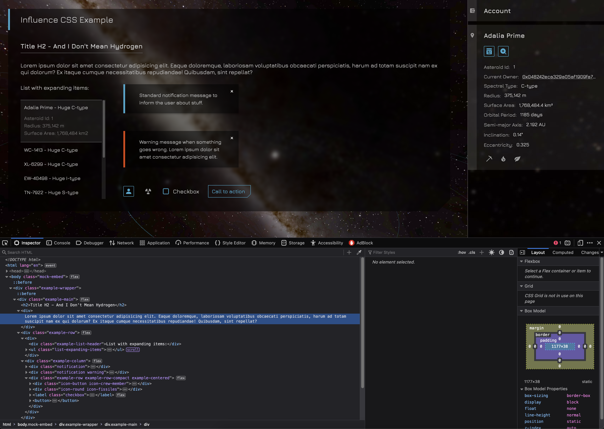

# Influence CSS

## Work in progress...

Styling recommended for embedding tools and content into the Influence game client, for example via [influence-tools-chrome-extension](https://github.com/Elerium-115/influence-tools-chrome-extension).

## Dev notes

The [/example](./example) folder contains a minimal page and styling that can help you to preview a page, before trying to embed it in-game. The actual contents of your page should be placed inside the `
` element. You can then use the following classes on the `<body>` element:

- `body.mock-embed` will mock a background that looks similar to the game layout, so you can test your content as if it were embedded in-game:

- `body.embed` defines the style that will be used when the page is actually embedded in-game. For example, it is *highly* recommended to use a transparent background, along with some of the basic in-game styles reproduced in [/style/influence-index.css](./style/influence-index.css).

    **Note:** You will likely want to set the `embed` class only when [the page is being shown in an iframe](https://stackoverflow.com/questions/925039/detect-iframe-embedding-in-javascript) - i.e. not on direct visits to your page, outside the game.

- `body` without any of the above classes defines the style that will be used in all contexts, including on direct visits to your page, outside the game.

---

Created by [@elerium115](https://twitter.com/elerium115) for the space strategy sandbox MMO [Influence](https://www.influenceth.io/).
